```mermaid
flowchart TB
    subgraph INTERNET["🌐 Internet"]
        WEB["Web Client\n(Browser / SPA)"]
        MOB["Mobile Client\n(iOS / Android)"]
        DEV["3rd Party Dev\n(API Consumer)"]
    end

    subgraph AWS_GLOBAL["AWS — Global Edge"]
        CF["Amazon CloudFront\n(CDN + Edge Cache)"]
        WAF["AWS WAF\n(Rate Limit / SQLi / XSS)"]
        COG["Amazon Cognito\n(User Pool + Identity Pool\nOIDC / SSO)"]
    end

    subgraph AWS_REGION["AWS Region — us-east-1"]

        subgraph VPC["VPC — 10.0.0.0/16"]

            subgraph PUBLIC["Public Subnets"]
                subgraph PUB_A["AZ us-east-1a — 10.0.1.0/24"]
                    ALB_A["ALB\n(Application Load Balancer)"]
                    APIGW_A["API Gateway\n(REST)"]
                    APIGW_WS_A["API Gateway\n(WebSocket)"]
                end
                subgraph PUB_B["AZ us-east-1b — 10.0.2.0/24"]
                    ALB_B["ALB\n(Replica)"]
                end
            end

            subgraph PRIVATE["Private Subnets"]
                subgraph PRIV_A["AZ us-east-1a — 10.0.3.0/24"]
                    subgraph EKS_A["EKS Node Group — AZ-a"]
                        AUTH["Auth\nService"]
                        USER["User\nService"]
                        TWEET["Tweet\nService"]
                        FEED["Feed\nService"]
                    end
                end
                subgraph PRIV_B["AZ us-east-1b — 10.0.4.0/24"]
                    subgraph EKS_B["EKS Node Group — AZ-b"]
                        FANOUT["Fan-out\nService"]
                        MEDIA["Media\nService"]
                        NOTIF["Notification\nService"]
                        SEARCH["Search\nService"]
                    end
                end
            end

            subgraph ISOLATED["Isolated Subnets — Data Layer"]
                subgraph ISO_A["AZ us-east-1a — 10.0.5.0/24"]
                    RDS_PRIMARY["RDS PostgreSQL\n(Primary)\nUsers + Follows\nNotifications"]
                    REDIS_PRIMARY["ElastiCache Redis\n(Primary)\nFeed Cache"]
                    MSK_A["MSK Kafka\n(Broker 1)\nTweetCreated\nLikeEvent\nFollowEvent"]
                end
                subgraph ISO_B["AZ us-east-1b — 10.0.6.0/24"]
                    RDS_REPLICA["RDS PostgreSQL\n(Replica)\nRead Replica"]
                    REDIS_REPLICA["ElastiCache Redis\n(Replica)"]
                    MSK_B["MSK Kafka\n(Broker 2)"]
                    KEYSPACES["Amazon Keyspaces\n(Cassandra)\nTweets + Likes"]
                    OPENSEARCH["Amazon OpenSearch\nSearch Index\nTweets + Users"]
                end
            end

        end

        S3["Amazon S3\n(Media Storage)"]
        SECRETS["AWS Secrets Manager"]
        CW["Amazon CloudWatch\n(Metrics + Alarms)"]
        XRAY["AWS X-Ray\n(Distributed Tracing)"]

    end

    %% ── Client → Edge ──────────────────────────────
    WEB -->|HTTPS| CF
    MOB -->|HTTPS| CF
    DEV -->|HTTPS| CF

    %% ── Edge → Gateway ─────────────────────────────
    CF -->|cache miss| WAF
    WAF --> ALB_A
    WAF --> APIGW_A
    WAF -->|WS upgrade| APIGW_WS_A

    %% ── Cognito ─────────────────────────────────────
    WEB <-->|OIDC / Hosted UI| COG
    APIGW_A -->|validate JWT\nJWKS endpoint| COG
    ALB_A -->|validate JWT| COG

    %% ── Gateway → Services ──────────────────────────
    ALB_A --> AUTH
    APIGW_A --> USER
    APIGW_A --> TWEET
    APIGW_A --> FEED
    APIGW_A --> MEDIA
    APIGW_A --> SEARCH
    NOTIF -->|push| APIGW_WS_A

    %% ── ALB Replica ─────────────────────────────────
    ALB_A <-->|sync| ALB_B

    %% ── Inter-service gRPC ──────────────────────────
    FEED -->|gRPC GetTweetsByIds| TWEET

    %% ── Services → MSK ──────────────────────────────
    TWEET -->|publish TweetCreated\nLikeEvent| MSK_A
    MSK_A <-->|replicate| MSK_B
    MSK_A -->|consume| FANOUT
    MSK_A -->|consume| NOTIF
    MSK_A -->|consume| SEARCH

    %% ── Services → Databases ────────────────────────
    AUTH -->|read/write| RDS_PRIMARY
    USER -->|read/write| RDS_PRIMARY
    USER -->|read| RDS_REPLICA
    TWEET -->|read/write| KEYSPACES
    FEED -->|read/write| REDIS_PRIMARY
    FEED -->|cache miss| KEYSPACES
    FANOUT -->|read followers| RDS_REPLICA
    FANOUT -->|write feed| REDIS_PRIMARY
    MEDIA -->|upload| S3
    NOTIF -->|read/write| RDS_PRIMARY
    SEARCH -->|index| OPENSEARCH

    %% ── Redis replication ───────────────────────────
    REDIS_PRIMARY <-->|replicate| REDIS_REPLICA

    %% ── S3 → CDN ────────────────────────────────────
    S3 -->|media delivery| CF

    %% ── Observability ───────────────────────────────
    EKS_A -->|metrics + traces| CW
    EKS_B -->|metrics + traces| CW
    CW --> XRAY

    %% ── Secrets ─────────────────────────────────────
    EKS_A -->|fetch secrets| SECRETS
    EKS_B -->|fetch secrets| SECRETS

    %% ── Styles ──────────────────────────────────────
    classDef client       fill:#dae8fc,stroke:#6c8ebf,color:#000
    classDef edge         fill:#d5e8d4,stroke:#82b366,color:#000
    classDef gateway      fill:#fff2cc,stroke:#d6b656,color:#000
    classDef service      fill:#f8cecc,stroke:#b85450,color:#000
    classDef database     fill:#f5f5f5,stroke:#666666,color:#000
    classDef messaging    fill:#e1d5e7,stroke:#9673a6,color:#000
    classDef observ       fill:#ffe6cc,stroke:#d79b00,color:#000
    classDef global       fill:#e8f4f8,stroke:#0077b6,color:#000

    class WEB,MOB,DEV client
    class CF,WAF edge
    class ALB_A,ALB_B,APIGW_A,APIGW_WS_A gateway
    class AUTH,USER,TWEET,FEED,FANOUT,MEDIA,NOTIF,SEARCH service
    class RDS_PRIMARY,RDS_REPLICA,REDIS_PRIMARY,REDIS_REPLICA,KEYSPACES,OPENSEARCH database
    class MSK_A,MSK_B messaging
    class CW,XRAY,SECRETS observ
    class COG global
    class S3 database
```

# Estructura de carpetas para el proyecto

Segun el Documento tecnico se propone la siguiente estructura de carpetas para el proyecto tentativo del proyecto.

```bash
twitter-clone/
│
├── package.json                          # Monorepo root (npm workspaces)
├── tsconfig.base.json                    # TS base config compartido
├── .gitignore
├── .env.example
├── README.md
│
│
├── apps/                                 # Aplicaciones ejecutables
│   │
│   ├── web/                              # Frontend — Vite + React (ESM)
│   │   ├── package.json                  # "type": "module" SOLO aquí
│   │   ├── tsconfig.json                 # Extiende base, module: ESNext
│   │   ├── vite.config.ts
│   │   ├── index.html
│   │   ├── public/
│   │   └── src/
│   │       ├── main.tsx
│   │       ├── App.tsx
│   │       ├── router/
│   │       │   └── index.tsx
│   │       ├── pages/
│   │       │   ├── Login.tsx
│   │       │   ├── Home.tsx
│   │       │   ├── Profile.tsx
│   │       │   └── Search.tsx
│   │       ├── components/
│   │       │   ├── Tweet/
│   │       │   │   ├── TweetCard.tsx
│   │       │   │   ├── TweetComposer.tsx
│   │       │   │   └── TweetList.tsx
│   │       │   ├── Feed/
│   │       │   │   └── FeedTimeline.tsx
│   │       │   ├── User/
│   │       │   │   ├── UserProfile.tsx
│   │       │   │   └── FollowButton.tsx
│   │       │   └── common/
│   │       │       ├── Button.tsx
│   │       │       ├── Avatar.tsx
│   │       │       └── Spinner.tsx
│   │       ├── hooks/
│   │       │   ├── useAuth.ts
│   │       │   ├── useFeed.ts
│   │       │   └── useTweet.ts
│   │       ├── stores/
│   │       │   ├── auth.store.ts
│   │       │   └── feed.store.ts
│   │       ├── services/
│   │       │   ├── api.client.ts         # Configura instancia base del sdk-client
│   │       │   ├── auth.api.ts           # Wrapper sobre @twitter-clone/sdk-client
│   │       │   ├── tweet.api.ts          # Wrapper sobre @twitter-clone/sdk-client
│   │       │   ├── feed.api.ts           # Wrapper sobre @twitter-clone/sdk-client
│   │       │   └── user.api.ts           # Wrapper sobre @twitter-clone/sdk-client
│   │       ├── config/
│   │       │   └── cognito.config.ts
│   │       └── types/
│   │           └── index.ts              # Re-exporta desde @twitter-clone/shared
│   │
│   └── services/                         # Microservicios backend (CJS)
│       │
│       ├── auth-service/
│       │   ├── package.json
│       │   ├── tsconfig.json
│       │   ├── Dockerfile
│       │   ├── src/
│       │   │   ├── index.ts
│       │   │   ├── routes/
│       │   │   │   └── auth.routes.ts    # Implementa interfaz sdk-server
│       │   │   ├── controllers/
│       │   │   │   └── auth.controller.ts
│       │   │   ├── services/
│       │   │   │   └── auth.service.ts
│       │   │   ├── middleware/
│       │   │   │   └── validate-jwt.ts
│       │   │   └── config/
│       │   │       └── cognito.config.ts
│       │   └── test/
│       │       └── auth.service.test.ts
│       │
│       ├── user-service/
│       │   ├── package.json
│       │   ├── tsconfig.json
│       │   ├── Dockerfile
│       │   ├── src/
│       │   │   ├── index.ts
│       │   │   ├── routes/
│       │   │   │   └── user.routes.ts    # Implementa interfaz sdk-server
│       │   │   ├── controllers/
│       │   │   │   └── user.controller.ts
│       │   │   ├── services/
│       │   │   │   └── user.service.ts
│       │   │   ├── repositories/
│       │   │   │   └── user.repository.ts
│       │   │   ├── models/
│       │   │   │   └── user.model.ts
│       │   │   └── config/
│       │   │       └── db.config.ts
│       │   └── test/
│       │       └── user.service.test.ts
│       │
│       ├── tweet-service/
│       │   ├── package.json
│       │   ├── tsconfig.json
│       │   ├── Dockerfile
│       │   ├── src/
│       │   │   ├── index.ts
│       │   │   ├── routes/
│       │   │   │   └── tweet.routes.ts   # Implementa interfaz sdk-server
│       │   │   ├── controllers/
│       │   │   │   └── tweet.controller.ts
│       │   │   ├── services/
│       │   │   │   └── tweet.service.ts
│       │   │   ├── repositories/
│       │   │   │   └── tweet.repository.ts
│       │   │   ├── models/
│       │   │   │   └── tweet.model.ts
│       │   │   ├── events/
│       │   │   │   └── tweet.producer.ts
│       │   │   └── config/
│       │   │       └── keyspaces.config.ts
│       │   └── test/
│       │       └── tweet.service.test.ts
│       │
│       ├── feed-service/
│       │   ├── package.json
│       │   ├── tsconfig.json
│       │   ├── Dockerfile
│       │   ├── src/
│       │   │   ├── index.ts
│       │   │   ├── routes/
│       │   │   │   └── feed.routes.ts    # Implementa interfaz sdk-server
│       │   │   ├── controllers/
│       │   │   │   └── feed.controller.ts
│       │   │   ├── services/
│       │   │   │   └── feed.service.ts
│       │   │   ├── repositories/
│       │   │   │   ├── feed.cache.repository.ts
│       │   │   │   └── feed.db.repository.ts
│       │   │   └── grpc/
│       │   │       └── tweet.client.ts
│       │   └── test/
│       │       └── feed.service.test.ts
│       │
│       ├── fanout-service/
│       │   ├── package.json
│       │   ├── tsconfig.json
│       │   ├── Dockerfile
│       │   ├── src/
│       │   │   ├── index.ts
│       │   │   ├── consumers/
│       │   │   │   └── tweet-created.consumer.ts
│       │   │   ├── services/
│       │   │   │   └── fanout.service.ts
│       │   │   └── repositories/
│       │   │       ├── follower.repository.ts
│       │   │       └── feed.cache.repository.ts
│       │   └── test/
│       │       └── fanout.service.test.ts
│       │
│       ├── media-service/
│       │   ├── package.json
│       │   ├── tsconfig.json
│       │   ├── Dockerfile
│       │   ├── src/
│       │   │   ├── index.ts
│       │   │   ├── routes/
│       │   │   │   └── media.routes.ts   # Implementa interfaz sdk-server
│       │   │   ├── controllers/
│       │   │   │   └── media.controller.ts
│       │   │   ├── services/
│       │   │   │   └── media.service.ts
│       │   │   └── repositories/
│       │   │       └── s3.repository.ts
│       │   └── test/
│       │       └── media.service.test.ts
│       │
│       ├── notification-service/
│       │   ├── package.json
│       │   ├── tsconfig.json
│       │   ├── Dockerfile
│       │   ├── src/
│       │   │   ├── index.ts
│       │   │   ├── consumers/
│       │   │   │   ├── like.consumer.ts
│       │   │   │   └── follow.consumer.ts
│       │   │   ├── services/
│       │   │   │   └── notification.service.ts
│       │   │   ├── repositories/
│       │   │   │   └── notification.repository.ts
│       │   │   └── websocket/
│       │   │       └── ws.publisher.ts
│       │   └── test/
│       │       └── notification.service.test.ts
│       │
│       └── search-service/
│           ├── package.json
│           ├── tsconfig.json
│           ├── Dockerfile
│           ├── src/
│           │   ├── index.ts
│           │   ├── routes/
│           │   │   └── search.routes.ts  # Implementa interfaz sdk-server
│           │   ├── controllers/
│           │   │   └── search.controller.ts
│           │   ├── services/
│           │   │   └── search.service.ts
│           │   ├── consumers/
│           │   │   └── tweet-index.consumer.ts
│           │   └── repositories/
│           │       └── opensearch.repository.ts
│           └── test/
│               └── search.service.test.ts
│
│
├── packages/                             # Librerías internas
│   │
│   ├── shared/                           # Utils, tipos base, middleware (dual ESM/CJS)
│   │   ├── package.json
│   │   ├── tsconfig.cjs.json
│   │   ├── tsconfig.esm.json
│   │   └── src/
│   │       ├── index.ts
│   │       ├── middleware/
│   │       │   ├── auth.middleware.ts
│   │       │   ├── error-handler.ts
│   │       │   └── request-logger.ts
│   │       ├── errors/
│   │       │   ├── app.error.ts
│   │       │   ├── not-found.error.ts
│   │       │   └── forbidden.error.ts
│   │       ├── utils/
│   │       │   ├── logger.ts
│   │       │   ├── pagination.ts
│   │       │   └── jwt.utils.ts
│   │       └── config/
│   │           └── secrets-manager.ts
│   │
│   ├── sdk-client/                       # Generado por Smithy — cliente tipado (ESM)
│   │   ├── package.json                  # "type": "module" — consumido por Vite
│   │   ├── tsconfig.json
│   │   ├── .gitignore                    # Ignorar /src/generated/
│   │   ├── scripts/
│   │   │   └── generate.sh               # Corre gradle smithy build → copia output aquí
│   │   └── src/
│   │       ├── index.ts                  # Re-exporta todo lo generado
│   │       ├── generated/                # ← Todo este directorio es autogenerado
│   │       │   ├── TwitterClient.ts      # Cliente principal con todos los métodos
│   │       │   ├── commands/             # Un archivo por operación
│   │       │   │   ├── CreateTweetCommand.ts
│   │       │   │   ├── GetTweetCommand.ts
│   │       │   │   ├── DeleteTweetCommand.ts
│   │       │   │   ├── GetFeedCommand.ts
│   │       │   │   ├── GetUserCommand.ts
│   │       │   │   ├── UpdateUserCommand.ts
│   │       │   │   ├── FollowUserCommand.ts
│   │       │   │   ├── UnfollowUserCommand.ts
│   │       │   │   ├── LikeTweetCommand.ts
│   │       │   │   ├── UnlikeTweetCommand.ts
│   │       │   │   └── SearchCommand.ts
│   │       │   ├── models/               # Tipos generados desde las estructuras Smithy
│   │       │   │   ├── Tweet.ts
│   │       │   │   ├── User.ts
│   │       │   │   ├── Feed.ts
│   │       │   │   └── errors/
│   │       │   │       ├── TweetNotFoundException.ts
│   │       │   │       ├── UserNotFoundException.ts
│   │       │   │       └── ForbiddenException.ts
│   │       │   └── protocols/
│   │       │       └── rest-json.ts      # Serialización/deserialización HTTP
│   │       └── config/
│   │           └── client.config.ts      # Base URL, auth headers, retry config
│   │
│   └── sdk-server/                       # Generado por Smithy — contratos server (CJS)
│       ├── package.json                  # Sin "type": "module" — consumido por servicios
│       ├── tsconfig.json
│       ├── .gitignore                    # Ignorar /src/generated/
│       ├── scripts/
│       │   └── generate.sh               # Corre gradle smithy build → copia output aquí
│       └── src/
│           ├── index.ts
│           └── generated/                # ← Todo este directorio es autogenerado
│               ├── operations/           # Interfaces que cada servicio debe implementar
│               │   ├── ICreateTweet.ts
│               │   ├── IGetTweet.ts
│               │   ├── IDeleteTweet.ts
│               │   ├── IGetFeed.ts
│               │   ├── IGetUser.ts
│               │   ├── IUpdateUser.ts
│               │   ├── IFollowUser.ts
│               │   ├── IUnfollowUser.ts
│               │   ├── ILikeTweet.ts
│               │   ├── IUnlikeTweet.ts
│               │   └── ISearch.ts
│               ├── models/               # Mismos tipos que sdk-client, lado server
│               │   ├── Tweet.ts
│               │   ├── User.ts
│               │   ├── Feed.ts
│               │   └── errors/
│               │       ├── TweetNotFoundException.ts
│               │       ├── UserNotFoundException.ts
│               │       └── ForbiddenException.ts
│               └── validation/           # Validadores generados por Smithy traits
│                   ├── tweet.validator.ts
│                   └── user.validator.ts
│
│
├── api-model/                            # Fuente de verdad — modelos Smithy
│   ├── build.gradle
│   ├── settings.gradle
│   ├── smithy-build.json                 # Define proyecciones → typescript-client, typescript-server
│   └── model/
│       ├── common.smithy
│       ├── service.smithy
│       ├── user.smithy
│       ├── tweet.smithy
│       ├── feed.smithy
│       ├── like.smithy
│       └── follow.smithy
│
│
├── infrastructure/                       # CDK TypeScript (CJS)
│   ├── package.json
│   ├── tsconfig.json
│   ├── cdk.json
│   ├── bin/
│   │   └── app.ts
│   ├── lib/
│   │   ├── stacks/
│   │   │   ├── networking-stack.ts
│   │   │   ├── eks-stack.ts
│   │   │   ├── auth-stack.ts
│   │   │   ├── database-stack.ts
│   │   │   ├── cache-stack.ts
│   │   │   ├── messaging-stack.ts
│   │   │   ├── storage-stack.ts
│   │   │   ├── cdn-stack.ts
│   │   │   ├── gateway-stack.ts
│   │   │   ├── search-stack.ts
│   │   │   └── monitoring-stack.ts
│   │   ├── constructs/
│   │   │   ├── microservice-construct.ts
│   │   │   ├── rds-construct.ts
│   │   │   ├── redis-construct.ts
│   │   │   ├── msk-construct.ts
│   │   │   ├── cognito-construct.ts
│   │   │   └── alarm-construct.ts
│   │   └── config/
│   │       ├── environments.ts
│   │       └── constants.ts
│   └── test/
│       ├── networking-stack.test.ts
│       └── auth-stack.test.ts
│
│
├── k8s/
│   ├── base/
│   │   ├── namespace.yaml
│   │   └── service-account.yaml
│   └── services/
│       ├── auth-service/
│       │   ├── deployment.yaml
│       │   ├── service.yaml
│       │   └── hpa.yaml
│       ├── user-service/
│       ├── tweet-service/
│       ├── feed-service/
│       ├── fanout-service/
│       ├── media-service/
│       ├── notification-service/
│       └── search-service/
│
│
├── docs/
│   ├── architecture.drawio
│   ├── authn-flow.md
│   ├── authz-model.md
│   ├── tech-document.md
│   └── runbooks/
│       ├── cache-invalidation.md
│       └── search-reindex.md
│
│
└── .github/
    └── workflows/
        ├── ci.yml
        ├── smithy-generate.yml           # Corre gradle build y commitea los generated/
        ├── deploy-beta.yml
        ├── deploy-gamma.yml
        └── deploy-prod.yml
```

## Inconsistencias

En proyectos monorepo se crean packages/shared con librerias internas compartidas, en caso que todo sea Javascript, los proyectos frontend pueden usar ESM mientras los servicios backend llevan CJS. Para el incidente previo se tiene el siguiente fix:

### Dónde vive el ESM/CJS fix

El problema queda **aislado en un solo lugar**: `packages/shared/package.json`.

```json
{
  "name": "@twitter-clone/shared",
  "version": "1.0.0",
  "main": "./dist/cjs/index.js",
  "module": "./dist/esm/index.js",
  "types": "./dist/cjs/index.d.ts",
  "exports": {
    ".": {
      "import": "./dist/esm/index.js",
      "require": "./dist/cjs/index.js",
      "types": "./dist/cjs/index.d.ts"
    }
  },
  "scripts": {
    "build": "tsc -p tsconfig.cjs.json && tsc -p tsconfig.esm.json"
  }
}
```

El resto del monorepo no toca esto — cada consumidor recibe automáticamente el formato correcto:

| Consumidor | Resuelve a |
| --- | --- |
| `apps/web` (Vite, ESM) | `dist/esm/index.js` vía `import` |
| `apps/services/*` (Node.js, CJS) | `dist/cjs/index.js` vía `require` |
| `infrastructure/` (CDK, CJS) | `dist/cjs/index.js` vía `require` |

### Regla de oro para el equipo

| Archivo | ¿Quién lo edita? |
| --- | --- |
| `api-model/model/*.smithy` | El equipo — es la fuente de verdad |
| `sdk-client/src/generated/*` | Nadie — solo el build de Smithy |
| `sdk-server/src/generated/*` | Nadie — solo el build de Smithy |
| `sdk-client/src/config/*` | El equipo — configuración del cliente |
| `apps/web/src/services/*` | El equipo — wrappers sobre el cliente generado |
| `apps/services/*/routes/*` | El equipo — implementa las interfaces generadas |

# Plan

# Product Backlog — Twitter Clone Demo

---

## Épica 1 — Fundamentos del Proyecto

Base técnica que habilita el desarrollo de todas las demás épicas.

**HU-01 — Setup del monorepo**
Como developer, quiero tener el monorepo configurado con workspaces, tsconfig base y scripts compartidos, para que el equipo pueda trabajar de forma consistente desde el inicio.

**HU-02 — Setup de infraestructura base CDK**
Como developer, quiero tener los stacks CDK iniciales (networking, EKS, IAM) desplegados en el ambiente beta, para poder desplegar servicios sobre ellos.

**HU-03 — Pipeline CI/CD base**
Como developer, quiero tener los workflows de GitHub Actions configurados para lint, tests y deploy automático a beta, para que cada PR tenga validación automática.

**HU-04 — Shared package con dual ESM/CJS**
Como developer, quiero tener el paquete `@twitter-clone/shared` compilando a ESM y CJS, para que tanto el frontend como los servicios backend puedan consumirlo sin conflictos.

**HU-05 — Setup de observabilidad base**
Como developer, quiero tener CloudWatch configurado con el dashboard principal y las alarmas críticas, para detectar problemas desde el primer despliegue.

---

## Épica 2 — Autenticación y Autorización

Gestión de identidad completa con Cognito, OIDC y modelo de roles.

**HU-06 — Cognito User Pool y configuración OIDC**
Como developer, quiero tener el stack de Cognito desplegado con User Pool, Resource Server y scopes definidos, para que los demás servicios puedan validar tokens.

**HU-07 — Flujo de registro**
Como usuario, quiero poder crear una cuenta con email y contraseña, para acceder a la plataforma.

**HU-08 — Flujo de login**
Como usuario, quiero poder iniciar sesión con mis credenciales y recibir un JWT, para autenticarme en la aplicación.

**HU-09 — Login federado SSO (Google)**
Como usuario, quiero poder iniciar sesión con mi cuenta de Google via Cognito Hosted UI, para no tener que crear credenciales nuevas.

**HU-10 — Refresh de tokens**
Como usuario, quiero que mi sesión se renueve automáticamente sin tener que volver a logearme, para tener una experiencia fluida.

**HU-11 — Modelo de roles y scopes**
Como developer, quiero que los grupos de Cognito (admin, moderator, user) se mapeen a IAM Roles y scopes en el Access Token, para poder hacer AuthZ por rol en el API Gateway.

**HU-12 — Middleware de validación JWT**
Como developer, quiero tener el middleware de validación JWT en `shared/`, para que todos los servicios lo reutilicen sin duplicar lógica.

---

## Épica 3 — Gestión de Usuarios

Todo lo relacionado con perfiles y el grafo social (follows).

**HU-13 — Crear y obtener perfil de usuario**
Como usuario, quiero que mi perfil se cree automáticamente al registrarme y poder consultarlo por handle, para tener identidad en la plataforma.

**HU-14 — Editar perfil**
Como usuario, quiero poder actualizar mi nombre, bio y foto de perfil, para personalizar mi cuenta.

**HU-15 — Seguir a otro usuario**
Como usuario, quiero poder seguir a otros usuarios, para ver su contenido en mi feed.

**HU-16 — Dejar de seguir a un usuario**
Como usuario, quiero poder dejar de seguir a alguien, para que su contenido no aparezca en mi feed.

**HU-17 — Ver lista de seguidores y seguidos**
Como usuario, quiero poder ver quién me sigue y a quién sigo, para gestionar mi red social.

---

## Épica 4 — Tweets

Ciclo de vida completo de la unidad de contenido principal.

**HU-18 — Publicar un tweet**
Como usuario, quiero poder publicar un tweet de hasta 280 caracteres, para compartir contenido con mis seguidores.

**HU-19 — Eliminar un tweet**
Como usuario, quiero poder eliminar mis propios tweets, para gestionar mi contenido publicado.

**HU-20 — Ver un tweet individual**
Como usuario, quiero poder ver el detalle de un tweet con sus métricas (likes, retweets), para leer el contenido completo.

**HU-21 — Dar y quitar like a un tweet**
Como usuario, quiero poder dar like a un tweet y quitarlo, para expresar que me gustó un contenido.

**HU-22 — Retweetear**
Como usuario, quiero poder retweetear el contenido de otros usuarios, para amplificar publicaciones en mi red.

**HU-23 — Responder a un tweet**
Como usuario, quiero poder responder a un tweet, para generar conversaciones en hilo.

---

## Épica 5 — Feed

Construcción y entrega del timeline personalizado.

**HU-24 — Feed cronológico básico**
Como usuario, quiero ver en mi feed los tweets de las cuentas que sigo ordenados por fecha, para consumir contenido relevante.

**HU-25 — Paginación del feed con cursor**
Como usuario, quiero poder cargar más tweets al hacer scroll, para explorar contenido más antiguo sin recargar la página.

**HU-26 — Fan-out al publicar un tweet**
Como developer, quiero que al publicar un tweet se dispare el proceso de fan-out que escribe en el cache de feed de cada follower, para que el feed se actualice en tiempo real.

**HU-27 — Cache de feed en Redis**
Como developer, quiero que el feed se sirva desde ElastiCache Redis con fallback a Keyspaces en caso de miss, para cumplir el target de latencia p99 < 200ms.

---

## Épica 6 — Búsqueda

Indexación y consulta de contenido.

**HU-28 — Indexación de tweets en OpenSearch**
Como developer, quiero que cada tweet publicado se indexe automáticamente en OpenSearch via Kafka, para habilitarlo en la búsqueda.

**HU-29 — Buscar tweets por keyword o hashtag**
Como usuario, quiero poder buscar tweets por palabras clave y hashtags, para descubrir contenido de mi interés.

**HU-30 — Buscar usuarios por handle**
Como usuario, quiero poder buscar usuarios por su handle o nombre, para encontrar cuentas a las que seguir.

---

## Épica 7 — Notificaciones

Sistema de eventos en tiempo real para interacciones.

**HU-31 — Notificación de nuevo seguidor**
Como usuario, quiero recibir una notificación cuando alguien me sigue, para saber quién se interesa en mi contenido.

**HU-32 — Notificación de like**
Como usuario, quiero recibir una notificación cuando alguien da like a mi tweet, para medir el alcance de mi contenido.

**HU-33 — Notificación de retweet y mención**
Como usuario, quiero recibir una notificación cuando me mencionan o retweetean, para poder responder e interactuar.

**HU-34 — Entrega en tiempo real via WebSocket**
Como usuario, quiero que las notificaciones lleguen instantáneamente sin recargar la página, para tener una experiencia en tiempo real.

**HU-35 — Bandeja de notificaciones**
Como usuario, quiero poder ver todas mis notificaciones en una lista y marcarlas como leídas, para gestionar mis interacciones pendientes.

#### HU-36 — Setup de Vite + React + Cognito + sdk-client

Como developer, quiero tener la app web en `apps/web/` configurada con Vite, React Router y el cliente de Cognito, y con `@twitter-clone/sdk-client` instalado como dependencia del workspace, para que los developers puedan construir páginas consumiendo los comandos tipados generados por Smithy en lugar de escribir llamadas HTTP a mano.

Consideraciones técnicas:

- `apps/web/package.json` debe tener `"type": "module"` y referenciar `@twitter-clone/sdk-client` vía workspace.
- `sdk-client` debe estar compilado a ESM antes de que Vite resuelva las importaciones — agregar `sdk-client build` como paso previo en el script de dev.
- Los archivos en `apps/web/src/services/` actúan como wrappers delgados sobre los comandos del sdk-client, no llaman a axios directamente.

---

## Épica 8 — Frontend Web

Interfaz de usuario que consume todas las APIs anteriores.

**HU-36 — Setup de Vite + React + Cognito Amplify**
Como developer, quiero tener la app web configurada con Vite, React Router y el cliente de Cognito, para que los developers puedan construir páginas sobre una base funcional.

**HU-37 — Pantalla de login y registro**
Como usuario, quiero ver una pantalla de login y registro clara, para poder autenticarme en la plataforma.

**HU-38 — Pantalla de feed principal**
Como usuario, quiero ver mi feed de tweets al iniciar sesión, para consumir contenido inmediatamente.

**HU-39 — Composer de tweets**
Como usuario, quiero tener un campo visible para escribir y publicar tweets desde el feed, para publicar contenido fácilmente.

**HU-40 — Pantalla de perfil de usuario**
Como usuario, quiero ver el perfil de cualquier usuario con sus tweets y métricas, para conocer su actividad en la plataforma.

**HU-41 — Pantalla de búsqueda**
Como usuario, quiero tener una pantalla de búsqueda con resultados de tweets y usuarios, para descubrir contenido y cuentas.

**HU-42 — Panel de notificaciones**
Como usuario, quiero ver mis notificaciones en un panel accesible desde la navegación principal, para no perderme ninguna interacción.

---

## Épica 9 — API Model (Smithy)

Definición formal del contrato de todas las APIs y generación automática de cliente y servidor tipados como paquetes del monorepo.

**HU-43 — Modelos Smithy por recurso**
Como developer, quiero tener los archivos `.smithy` definidos por cada recurso (User, Tweet, Feed, Like, Follow) en `api-model/model/`, para tener el contrato de la API como única fuente de verdad del equipo.

**HU-44 — Configurar proyecciones de generación en smithy-build.json**
Como developer, quiero que `smithy-build.json` tenga las proyecciones `typescript-client` y `typescript-server` configuradas, para que un solo `gradle build` genere el código para ambos paquetes.

**HU-45 — Build genera sdk-client como paquete ESM del monorepo**
Como developer, quiero que el output de Smithy para el cliente se copie automáticamente a `packages/sdk-client/src/generated/`, para que `apps/web` pueda importar comandos y tipos directamente desde `@twitter-clone/sdk-client` sin escribir el cliente a mano.

**HU-46 — Build genera sdk-server como paquete CJS del monorepo**
Como developer, quiero que el output de Smithy para el servidor se copie automáticamente a `packages/sdk-server/src/generated/`, para que cada microservicio en `apps/services/` implemente las interfaces generadas y los validadores automáticos en lugar de definirlos manualmente.

**HU-47 — Script de generación y workflow CI para Smithy**
Como developer, quiero que exista un script `generate.sh` en cada SDK package y un workflow `smithy-generate.yml` en GitHub Actions, para que cualquier cambio en los `.smithy` regenere automáticamente los paquetes y el equipo nunca trabaje con código desactualizado.

---

## Orden sugerido de desarrollo por sprint

| Sprint | Épicas |
| --- | --- |
| Sprint 1 | Épica 1 + Épica 2 (fundamentos + auth) |
| Sprint 2 | Épica 3 + Épica 4 (usuarios + tweets) |
| Sprint 3 | Épica 5 + Épica 9 (feed + smithy) |
| Sprint 4 | Épica 6 + Épica 7 (búsqueda + notificaciones) |
| Sprint 5 | Épica 8 (frontend completo + integración) |

---



---

Algunas notas del diagrama:

- Las **subnets públicas** tienen redundancia en dos AZs con el ALB replicado.
- Las **subnets privadas** distribuyen los servicios EKS entre AZ-a y AZ-b para alta disponibilidad.
- Las **subnets aisladas** no tienen acceso a internet, solo los servicios internos pueden alcanzar las bases de datos.
- **Cognito y CloudFront** viven fuera de la VPC porque son servicios globales de AWS.
- **MSK** tiene sus brokers distribuidos entre AZs con replicación entre ellos.
