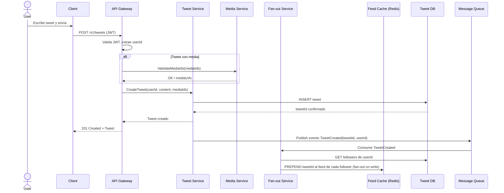
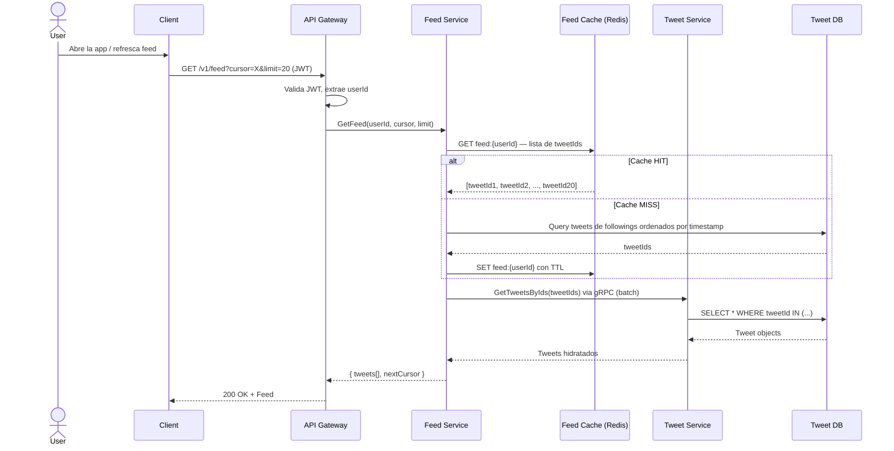
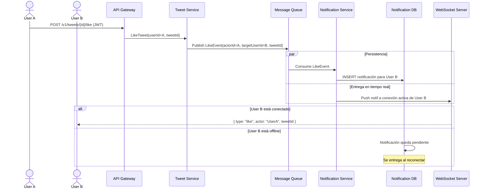
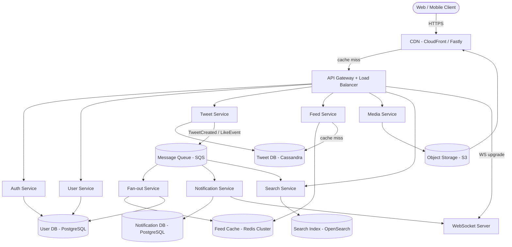
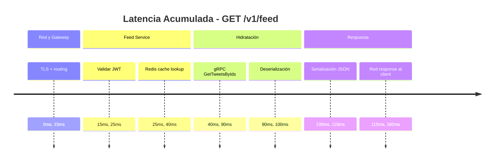
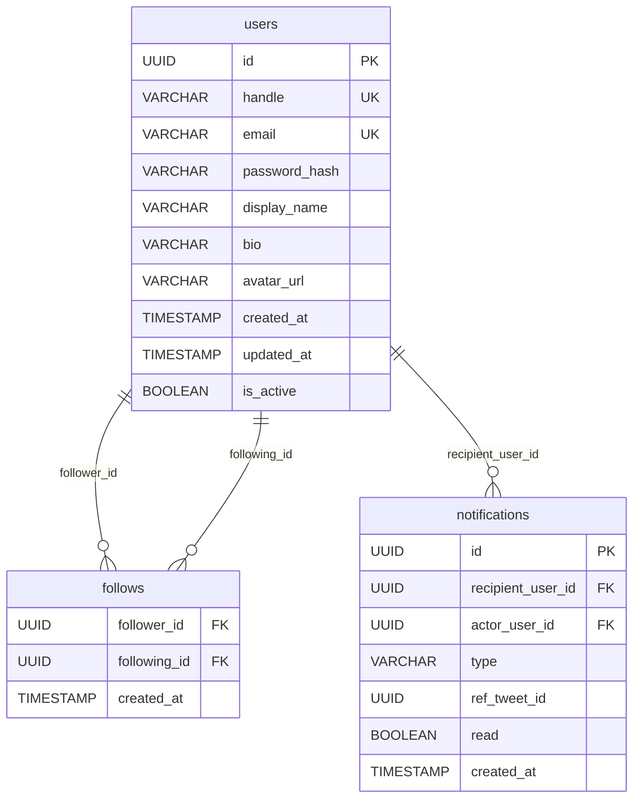
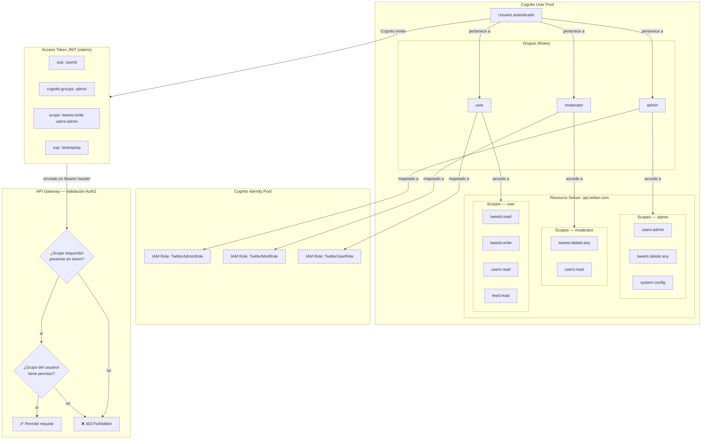
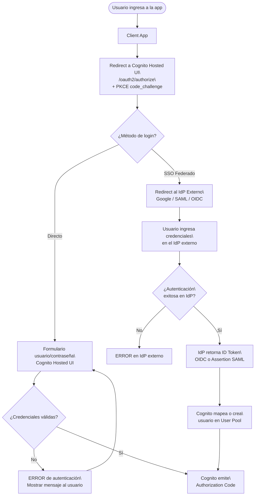
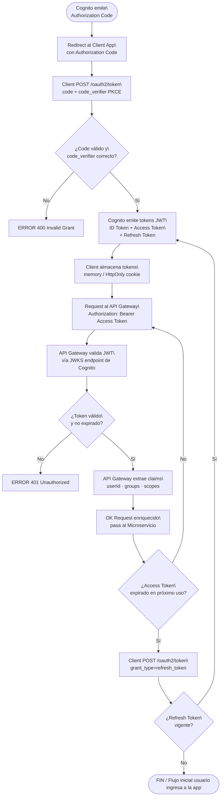
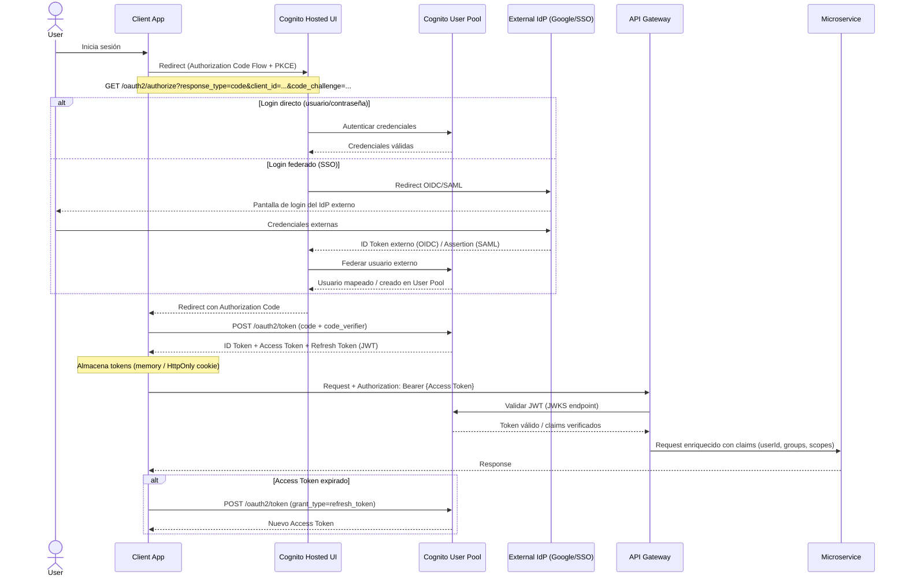

# X(dot)com - Diseño Técnico

### Estado del documento: En revisión  ·  *(implementación: beta desplegado en AWS — ver «[Estado de implementación](#estado-de-implementación-beta--junio-2026)» más abajo)*

## Resumen

El presente proyecto consiste en el diseño y desarrollo de una plataforma red social en la nube, inspirada en la arquitectura de X. Esta permitira a los usuarios publicar mensajes cortos, seguir a otros usuarios, interactuar mediante likes y retweets, y consumir un feed personalizado. Los clientes objetivo se clasifican en tres categorias: Usuarios finales, personas que buscan una plataforma de comunicación en tiempo real, visualización de contenido y networking social. Creadores de contenido, quienes son personas o marcas que necesitan difundir información, noticias o entretenimiento a una audiencia diaria. Desarrolladores terceros, donde equipos consumen la API pública para construir integraciones, bots o aplicaciones derivadas. Esta plataforma resuelve la necesidad de comunicación masiva y en tiempo real con baja lantencia, alta disponibilidad y escalabilidad global, garantizando que los mensajes lleguen a millones de usuarios de forma instantánea y confiable.

## Estado de implementación (beta — junio 2026)

> Este documento describe el **diseño objetivo** (arquitectura de producción a
> escala). Esta sección registra qué está **realmente implementado y desplegado**
> hoy en el entorno **beta** (AWS `us-east-2`). El resto del documento se conserva
> como intención de diseño; donde la implementación difiere, se indica en la tabla
> de *deltas* al final de esta sección.

### Alcance

**Fase 1 — MVP: ✅ completo (7/7).** Registro/autenticación/perfiles (handle
único, bio, avatar), tweets (≤280) con likes y retweets, feed cronológico con
paginación por cursor, follow/unfollow, búsqueda de usuarios y hashtags/keywords,
API REST `/v1`, e infraestructura cloud single-region con autoscaling de ECS.
Todo desplegado y funcionando end-to-end en beta.

**Fase 2 — parcial (~1.5/7):**

| Funcionalidad | Estado |
|---|---|
| Notificaciones en tiempo real (WebSocket) | ✅ implementado |
| Contenido multimedia | ⚠️ **imágenes sí; video no** |
| Feed con ML / recomendación | ❌ pendiente |
| Mensajería directa (DMs) | ❌ pendiente |
| Despliegue multi-región | ❌ pendiente (solo beta `us-east-2`; gamma/prod configurados, no desplegados) |
| API GraphQL | ❌ pendiente |
| Panel de analytics | ❌ pendiente |

**Fuera de alcance:** sin cambios — todo correctamente fuera (ads, KYC/blue check,
moderación con IA, apps nativas, cross-posting).

### Requerimientos funcionales (§1.1)

| # | Requerimiento | Estado |
|---|---|---|
| 1 | Cuenta, autenticación y perfil (nombre, bio, foto, handle único) | ✅ |
| 2 | Posts ≤280 con texto, hashtags **y menciones** | ⚠️ texto + hashtags ✅; **@menciones no** (solo scaffolding en la UI) |
| 3 | Follow/unfollow y feed de seguidos | ✅ |
| 4 | Likes, retweets **y respuestas** | ✅ |
| 5 | Búsqueda por hashtags, keywords y usuarios | ✅ |

**No funcionales (§1.2):** son objetivos de diseño, no medidos/validados.
*Implementado:* bcrypt (10 rounds) y cifrado en reposo (RDS/Keyspaces/S3/SQS).
*Parcial:* TLS en tránsito — CloudFront da HTTPS al viewer, pero el origen ALB es
HTTP en beta (falta ACM). *No validado/implementado:* 99.99% uptime, p99<200ms,
10M DAU, multi-región, RPO<1min, cumplimiento GDPR/CCPA.

### Diseño objetivo vs. implementación actual (deltas)

El resto del documento describe el diseño de producción; estas filas son los
puntos donde la implementación beta difiere a propósito (alcance MVP) o donde el
texto ya no refleja lo construido:

| Área | Diseño (este documento) | Implementación actual (beta) |
|---|---|---|
| Comunicación inter-servicio | gRPC (§3.5, §5.4, timing §5.3) | **HTTP/axios** vía el ALB (hidratación feed→tweet); las demás RPC internas no existen |
| WebSocket | Amazon API Gateway WebSocket (§6.2) | Servidor **`ws`** nativo en notification-service tras ALB/CloudFront (con heartbeat + reconexión del cliente) |
| Mensajería | colas **FIFO** `tweet-created.fifo` (§5.3, §6.2) | SNS **estándar** → 2 colas SQS **estándar** (con *guard* FIFO en `@xcloud/shared`) |
| Búsqueda | OpenSearch 3× `r6g.large`, autoscaling (§6.2) | 1× **`t3.small.search`**, sin autoscaling; cliente **`@opensearch-project` con firma SigV4** (no `@elastic/elasticsearch`) |
| Migraciones de schema | **Flyway** versionado (§6.1, §6.7) | Auto-creación al arrancar (`ensurePostgresSchema`) + `cassandra-init.cql` + `bootstrap-keyspaces.ts` |
| CI/CD | GitHub Actions → deploy auto beta/gamma/prod, AppConfig, Slack (§6.7) | **Manual** vía `scripts/deploy-beta.sh` / `build-push-images.sh` / `deploy-web.sh`; solo beta |
| Borde / gateway | API Gateway + ALB (§5.3, §6.2) | **Solo ALB** (+ CloudFront para el SPA y `/api/*`) |
| Observabilidad | X-Ray + PagerDuty (§6.3) | CloudWatch Container Insights + alarmas por **email** (sin X-Ray ni PagerDuty) |
| Seguridad de borde | WAF + TLS 1.3 en todos los endpoints (§6.4) | beta **HTTP-only** (sin WAF, sin ACM) |
| Autenticación | Cognito Hosted UI / OIDC (§6.4.2–3) | **JWT local (HS256)** que imita el payload de Cognito; el stack Cognito existe pero no está activo |
| AuthZ por scopes | modelo RBAC con scopes (§6.4.1) | el JWT lleva `cognito:groups`, pero las rutas solo validan `verifyToken` (sin enforcement por scope) |
| Región primaria | `us-east-1` (§6.8) | beta desplegado en **`us-east-2`** |

Detalle operativo del despliegue y cada incompatibilidad real corregida (Keyspaces,
SSL de RDS, *guard* FIFO de SNS/SQS, SigV4 de OpenSearch, arranque concurrente de
consumidores SQS): [`docs/runbooks/aws-deploy.md`](runbooks/aws-deploy.md).

## Supuestos

Los siguientes puntos son condiciones previas consideradas verdaderas para el diseño del sistema:

- La infraestructura principal será desplegada con el proveedor AWS, con soporte multi-region.
- Los usuarios tendrán acceso a internet con conectividad suficiente para consumir contenido en tiempo real.
- El sistema debe soportar desde el inicio un volumen de escritura y lectura de alta concurrencia, comparable a patrones de tráfico de redes sociales reales.
- Se asume disponibilidad de un equipo con experiencia en arquitectura de microservicios, bases de datos distribuidas y cloud-native development IaC.
- Los servicios de terceros (autenticación, almacenamiento de medios, CDN) estarán disponibles y contarán con SLAs aceptables.
- El cumplimiento de regulaciones de privacidad de datos (GDPR, CCPA u otras según región) es un requisito no negociable desde el diseño inicial.

## Alcance y fases

### Fase 1 — MVP (Core Social Platform)

- Registro, autenticación y gestión básica de perfiles de usuario.
- Publicación de tweets/posts con límite de caracteres, likes y retweets.
- Feed cronológico básico (sin algoritmo de recomendación).
- Seguimiento entre usuarios (follow/unfollow).
- Búsqueda básica de usuarios y hashtags.
- API REST pública v1.
- Infraestructura cloud single-region con escalado horizontal básico.

### Fase 2 — Escala y Experiencia Avanzada

- Feed personalizado basado en algoritmo de recomendación (ML).
- Soporte de contenido multimedia (imágenes y video corto).
- Notificaciones en tiempo real vía WebSockets o SSE.
- Mensajería directa entre usuarios (DMs).
- Despliegue multi-región con replicación global y baja latencia.
- API GraphQL como complemento a la REST existente.
- Panel de analytics para creadores de contenido.

### Fuera del Alcance

- Monetización y sistema de publicidad (ads platform).
- Verificación de identidad avanzada (blue check / KYC).
- Moderación de contenido automatizada con IA (considerada para una fase futura).
- Aplicaciones nativas iOS/Android (el alcance inicial es web + API).
- Integración con redes sociales externas (cross-posting).

## 1. Requerimientos

### 1.1 Requerimientos funcionales

- Los usuarios deben poder crear una cuenta, autenticarse y gestionar su perfil (nombre, bio, foto, handle único).
- Los usuarios deben poder publicar posts (tweets) de hasta 280 caracteres, incluyendo texto, hashtags y menciones.
- Los usuarios deben poder seguir y dejar de seguir a otros usuarios, y ver un feed con el contenido de las cuentas que siguen.
- Los usuarios deben poder interactuar con posts mediante likes, retweets y respuestas (replies).
- Los usuarios deben poder buscar contenido por hashtags, palabras clave y nombres de usuario.

### 1.2 Requerimientos no funcionales

- **Disponibilidad (CAP):** El sistema debe priorizar disponibilidad sobre consistencia estricta. Se acepta consistencia eventual, un usuario puede ver un conteo de likes ligeramente desactualizado, pero el sistema nunca debe estar caído. Target: **99.99% uptime**.
- **Escalabilidad:** El sistema debe soportar hasta **10 millones de usuarios activos diarios (DAU)**, con una proporción de lectura/escritura de aproximadamente **100:1** (los feeds son mucho más consultados que escritos).
- **Latencia:** La carga del feed del usuario debe tener un tiempo de respuesta menor a **200 ms** en el percentil p99. La publicación de un tweet debe confirmarse en menos de **500 ms**.
- **Durabilidad:** Los posts y datos de usuario no deben perderse bajo ninguna circunstancia. Se requiere replicación multi-región y backups automáticos con RPO < 1 minuto.
- **Seguridad y Cumplimiento:** El sistema debe cumplir con GDPR/CCPA. Las contraseñas deben almacenarse con hashing seguro (bcrypt/argon2), y todas las comunicaciones deben ir cifradas en tránsito (TLS 1.2+) y en reposo (AES-256).

**Usuarios** 
DAU:                        10,000,000 usuarios activos/día
Tweets publicados/día:      10M * 5% activos escribiendo = 500,000 tweets/día

**QPS (Escritura)**
500,000 tweets/día ÷ 86,400 s/día ≈ 5 TPS de escritura
Peak (x10):                 ~50 TPS en hora pico

**QPS (Lectura)**
Ratio lectura/escritura 100:1 → ~ 500 TPS de lectura
Peak (x10):                 ~5,000 TPS en hora pico

**Almacenamiento (Tweets)**
Tamaño promedio tweet:      300 bytes (texto + metadata)
500,000 tweets/día * 300 B = 150 MB/día
Anual:                      ~50 GB/año (solo texto)

**Ancho de Banda**
5,000 TPS lectura * 300 B = ~1.5 MB/s baseline
Peak:                       ~15 MB/s

## 2. Entidades principales

Las entidades centrales del sistema son los recursos que la API intercambiará y que el modelo de datos persistirá:

**Actores:**

- **User** — El actor principal del sistema. Representa a cualquier persona registrada que puede leer, escribir e interactuar con contenido.

**Contenido:**

- **Tweet:** La unidad mínima de contenido. Texto de hasta 280 caracteres, con metadata asociada (timestamp, autor, conteos de interacción).
- **Media:**  Archivos adjuntos a un Tweet (imágenes, videos cortos). Entidad separada por su ciclo de vida y almacenamiento independiente.
- **Hashtag:** Etiqueta extraída del contenido de un Tweet. Permite agrupación y búsqueda temática.

**Relaciones e Interacciones:**

- **Follow:** Relación direccional entre dos Users (follower → following). Define el grafo social del sistema.
- **Like:** Relación entre un User y un Tweet. Registro de interacción afirmativa.
- **Retweet:** Caso especial de Tweet que referencia a otro Tweet original, con o sin comentario adicional (quote tweet).
- **Reply:** Tweet que referencia a otro Tweet como hilo de conversación.

**Distribución:**

- **Feed:** Colección ordenada de Tweets construida y servida a un User específico. Puede ser materializada (pre-computada) o generada en tiempo real.
- **Notification:** Evento generado por interacciones (like, retweet, mention, nuevo follower) dirigido a un User destinatario.

## 3. API o Interfaz del Sistema

El protocolo principal es **REST** para APIs públicas y cliente-servidor. **gRPC** para comunicación interna entre microservicios donde la latencia es crítica. **WebSockets** para entrega de notificaciones y feed en tiempo real (Fase 2).

> Todas las rutas autenticadas derivan el `userId` del JWT token — nunca del cuerpo de la solicitud.
> 

### 3.1 Autenticación

```bash
POST /v1/auth/register
body: {
  "handle":   string,   // requerido, único, 4-20 chars, solo [a-zA-Z0-9_]
  "email":    string,   // requerido, formato válido, escapado HTML
  "password": string    // requerido, mín 8 chars, hasheado con argon2
}
response 201: { "userId": string, "token": JWT }
errors:
  400 — handle/email con formato inválido o caracteres prohibidos (;, <, >)
  409 — handle o email ya registrado

POST /v1/auth/login
body: {
  "email":    string,
  "password": string
}
response 200: { "token": JWT, "expiresAt": timestamp }
errors:
  401 — credenciales inválidas
  429 — rate limit excedido (máx 10 intentos/min por IP)
```

### 3.2 Usuarios

```bash
GET /v1/users/{handle}
response 200: {
  "userId":      string,
  "handle":      string,
  "displayName": string,
  "bio":         string,
  "avatarUrl":   string,
  "followersCount": int,
  "followingCount": int,
  "createdAt":   timestamp
}
errors:
  404 — usuario no encontrado

PUT /v1/users/me                          // Auth requerida
body: {
  "displayName": string,   // opcional, máx 50 chars
  "bio":         string,   // opcional, máx 160 chars
  "avatarUrl":   string    // opcional, URL válida
}
response 200: User
errors:
  400 — campos con formato inválido
  401 — token ausente o expirado

POST /v1/users/{userId}/follow            // Auth requerida
response 204: (no content)
errors:
  400 — un usuario no puede seguirse a sí mismo
  404 — usuario destino no encontrado
  409 — ya sigue a este usuario

DELETE /v1/users/{userId}/follow          // Auth requerida
response 204: (no content)
errors:
  404 — relación de follow no existe
```

### 3.3 Tweets

```bash
POST /v1/tweets                           // Auth requerida
body: {
  "content":       string,    // requerido, 1-280 chars, escapado HTML
  "mediaIds":      string[],  // opcional, máx 4 elementos
  "replyToTweetId": string    // opcional, para replies
}
response 201: Tweet
errors:
  400 — content vacío, supera 280 chars, o contiene caracteres prohibidos
  404 — replyToTweetId no existe
  401 — no autenticado

GET /v1/tweets/{tweetId}
response 200: {
  "tweetId":    string,
  "content":    string,
  "author":     User (parcial),
  "mediaUrls":  string[],
  "likesCount": int,
  "retweetCount": int,
  "repliesCount": int,
  "createdAt":  timestamp,
  "replyTo":    string | null
}
errors:
  404 — tweet no encontrado

DELETE /v1/tweets/{tweetId}               // Auth requerida
response 204: (no content)
errors:
  403 — el usuario no es autor del tweet
  404 — tweet no encontrado

POST /v1/tweets/{tweetId}/like            // Auth requerida
response 204: (no content)
errors:
  404 — tweet no encontrado
  409 — ya dio like a este tweet

DELETE /v1/tweets/{tweetId}/like          // Auth requerida
response 204: (no content)
errors:
  404 — like no existe

POST /v1/tweets/{tweetId}/retweet         // Auth requerida
body: {
  "comment": string   // opcional, máx 280 chars — convierte en quote tweet
}
response 201: Tweet
errors:
  404 — tweet original no encontrado
  409 — ya retweeteó este tweet (sin comentario)
```

### 3.4 Feed y búsqueda

```bash
GET /v1/feed                              // Auth requerida
query params:
  cursor:   string    // opcional, para paginación basada en cursor
  limit:    int       // opcional, default 20, máx 100
response 200: {
  "tweets": Tweet[],
  "nextCursor": string | null
}

GET /v1/search
query params:
  q:      string    // requerido, mín 2 chars, escapado
  type:   enum      // "tweets" | "users" — default "tweets"
  cursor: string    // opcional
  limit:  int       // opcional, default 20, máx 50
response 200: {
  "results": Tweet[] | User[],
  "nextCursor": string | null
}
errors:
  400 — q vacío o menor a 2 chars
```

### 3.5 APIs internas (gRPC - entre microservicios)

> **Implementación (beta):** la única comunicación inter-servicio que existe hoy
> (hidratación feed→tweet) usa **HTTP** a través del ALB, no gRPC; las RPC de
> abajo son diseño objetivo, no implementadas.

```bash
// Feed Service → Tweet Service
rpc GetTweetsByIds(TweetIdsRequest) returns (TweetsResponse)

// Notification Service → User Service
rpc GetUserNotificationPrefs(UserIdRequest) returns (NotifPrefsResponse)

// Media Service → Tweet Service
rpc ValidateMediaIds(MediaIdsRequest) returns (ValidationResponse)
```

## 4. Flujo de datos

Se describen los tres flujos críticos del sistema.

### 4.1 Publicación de un tweet



### 4.2 Lectura del Feed



### 4.3 Notificaciones en tiempo real



## 5. Diseño de alto nivel

### 5.3 Componentes

El sistema se compone de los siguientes servicios cloud-native, todos desplegados como contenedores Docker sobre Amazon ECS con Fargate (ver ADR-002) en infraestructura nueva aprovisionada en el proveedor cloud AWS.



**Descripción de cada componente:**

**CDN** — Sirve assets estáticos y respuestas cacheadas (perfiles, tweets populares). Reduce latencia global y descarga al API Gateway.

**API Gateway + Load Balancer** — Punto de entrada único. Responsable de routing, rate limiting, terminación TLS y validación del JWT antes de despachar al servicio correspondiente.

**Auth Service** — Emite y valida JWT. Gestiona registro, login y refresh tokens. Stateless; no tiene DB propia, delega la lectura de credenciales al User DB.

**User Service** — CRUD de perfiles y gestión del grafo social (follows). Lee y escribe en User DB (PostgreSQL) por su necesidad de consultas relacionales (followers, following counts).

**Tweet Service** — Creación, lectura y borrado de tweets. Persiste en Cassandra por su modelo de escritura intensiva y necesidad de escalado horizontal. Publica eventos a las colas SQS (`tweet-created.fifo`, `tweet-index`) tras cada operación relevante.

**Feed Service** — Construye y sirve el feed del usuario. Primero consulta Redis (feed pre-computado como lista de tweetIds). En cache miss, reconstruye desde TweetDB y re-cachea. Hidrata los tweetIds via gRPC al Tweet Service. *(beta: la hidratación es HTTP a través del ALB.)*

**Fan-out Service** — Consume mensajes de la cola SQS `xcloud-tweet-created.fifo`. Obtiene la lista de followers del autor desde User DB y escribe el tweetId en el feed cache de cada follower en Redis (fan-out on write). Para usuarios con millones de followers (celebrities), aplica fan-out on read en su lugar.

**Media Service** — Gestiona upload y validación de archivos multimedia. Almacena en S3 y retorna URLs públicas servidas por CDN.

**Search Service** — Indexa tweets y usuarios en OpenSearch al consumir mensajes de la cola SQS `xcloud-tweet-index`. Sirve queries de búsqueda full-text por hashtag, keyword y handle.

**Notification Service** — Consume mensajes de las colas SQS `xcloud-like-event` y `xcloud-follow-event`. Persiste notificaciones en NotifDB y las entrega en tiempo real via WebSocket Server.

**WebSocket Server** — Mantiene conexiones persistentes con clientes activos. Recibe push del Notification Service y los despacha al cliente correspondiente.

### 5.2 Modelo de datos por componente

```bash
UserDB (PostgreSQL)
─────────────────────────────
users:          id, handle, email, password_hash, display_name, bio, avatar_url, created_at
follows:        follower_id, following_id, created_at  [PK compuesto]

TweetDB (Cassandra)
─────────────────────────────
tweets:         tweet_id (UUID), user_id, content, media_urls, reply_to_tweet_id,
                likes_count, retweet_count, created_at
                [Partition key: user_id | Clustering key: created_at DESC]

likes:          tweet_id, user_id, created_at
                [Partition key: tweet_id]

Feed Cache (Redis)
─────────────────────────────
feed:{userId}   → List of tweetIds  [LPUSH, LTRIM a 800 entradas, TTL 24h]
tweet:{tweetId} → Hash con campos del tweet hidratado  [TTL 1h]

NotifDB (PostgreSQL)
─────────────────────────────
notifications:  id, recipient_user_id, actor_user_id, type (like/retweet/follow/mention),
                ref_tweet_id, read, created_at
```

### 5.3 Temporización - Flujo crítico: Lectura del Feed (p99 target < 200ms)



**Análisis:**

- El path feliz (cache hit en Redis) se mantiene por debajo de **160ms**, dentro del target p99 de 200ms.
- En cache miss (reconstrucción desde Cassandra), la latencia sube a ~350ms — mitigado manteniendo el cache con TTL de 24h y re-calentamiento proactivo en Fan-out Service.
- La hidratación via gRPC en batch es el paso más costoso (~50ms). Se optimiza en la sección de Inmersiones Profundas con un tweet cache secundario en Redis.

## 5.4 Decisiones de Diseño — Trade-offs

| Decisión | Alternativa considerada | Decisión tomada | Pros | Contras |
| --- | --- | --- | --- | --- |
| **Base de datos para tweets** | DynamoDB | Cassandra (Amazon Keyspaces) | Modelo columnar optimizado para escritura intensiva. Partition key por `user_id` + clustering por `created_at` — ideal para queries de timeline. Escala horizontal nativa. | Operaciones de JOIN inexistentes — requiere desnormalización. Consistencia eventual, no ACID. |
| **Base de datos para usuarios** | DynamoDB, MongoDB | PostgreSQL (Amazon RDS) | Queries relacionales para followers/following (grafo social). ACID para operaciones críticas de cuenta. Madurez y ecosistema. | Escalamiento horizontal limitado — mitigado con Read Replicas. Más costoso a escala masiva. |
| **Estrategia de fan-out del feed** | Fan-out on read (pull al consultar) | Fan-out on write (push al publicar) | Feed pre-computado en Redis — latencia de lectura mínima (~15ms). Experiencia de usuario más rápida. | Alto costo de escritura para cuentas con millones de followers (celebrity problem). Mitigado con fan-out on read para cuentas con >1M followers. |
| **Comunicación inter-servicio** | REST entre microservicios | gRPC para comunicación interna, REST para API pública | gRPC ~10x más rápido que REST (HTTP/2 + Protobuf binario). Contratos fuertes con Protobuf. Streaming bidireccional. | Mayor complejidad de implementación. Requiere generación de stubs. No legible directamente por humanos. |
| **Message broker** | Apache Kafka (Amazon MSK), RabbitMQ | Amazon SQS (ver ADR-001) | Primer 1M de requests/mes gratis — costo ~$0 a escala demo. Sin brokers que gestionar. Integración nativa con IAM, CloudWatch y Lambda; DLQ por cola. | Sin consumer groups ni replay de mensajes. Fan-out a múltiples consumers independientes requiere Amazon SNS. FIFO limitado a 3,000 msg/s. |

## 6. Inmersiones profundas

### 6.1 Esquema de la base de datos

Diagrama ER - UserDB (PostgreSQL en Amazon RDS)



**Tabla: tweets (Cassandra en Amazon Keyspaces)**

| Columna | Tipo | Restricciones | Descripción |
| --- | --- | --- | --- |
| tweet_id | UUID | PK | ID único del tweet (TIMEUUID) |
| user_id | UUID | Partition Key | Autor del tweet |
| content | TEXT | NOT NULL, max 280 | Contenido del tweet |
| media_urls | LIST TEXT | nullable | URLs de medios en S3/CDN |
| reply_to_tweet_id | UUID | nullable | FK lógico al tweet padre |
| likes_count | COUNTER | default 0 | Contador de likes |
| retweet_count | COUNTER | default 0 | Contador de retweets |
| is_deleted | BOOLEAN | default false | Soft delete |
| created_at | TIMESTAMP | NOT NULL | Clustering key DESC |

**Tabla: likes (Cassandra)**

| Columna | Tipo | Restricciones | Descripción |
| --- | --- | --- | --- |
| tweet_id | UUID | Partition Key | Tweet al que pertenece el like |
| user_id | UUID | Clustering Key | Usuario que dio like |
| created_at | TIMESTAMP | NOT NULL | Timestamp del like |

---

**Compatibilidad y Migraciones:**

- Todos los cambios de esquema en RDS se ejecutan mediante migraciones versionadas con **Flyway**, aplicadas en orden secuencial y con scripts de rollback definidos.
- En Keyspaces (Cassandra), los cambios de schema son aditivos únicamente (agregar columnas, nunca eliminar ni renombrar) para mantener compatibilidad con versiones anteriores de los servicios.
- Las migraciones se ejecutan en `beta` → `gamma` → `prod` antes de cualquier despliegue de código que dependa del nuevo schema.

### 6.2 Escalabilidad e Infraestructura (AWS)

**Estrategia de Escalado por Componente:**

| Componente | Servicio AWS | Estrategia |
| --- | --- | --- |
| API Gateway + LB | AWS ALB + API Gateway | Auto-scaling por métricas de request rate |
| Microservicios | Amazon ECS + Fargate | Service Auto Scaling (target tracking) por CPU/RPS, sin gestión de nodos |
| Tweet DB | Amazon Keyspaces | On-demand capacity, escala automática |
| User DB | Amazon RDS PostgreSQL | Multi-AZ, Read Replicas para lecturas |
| Feed Cache | Amazon ElastiCache (Redis Cluster) | Sharding por userId, cluster mode ON |
| Message Queue | Amazon SQS | Escala nativa sin gestión de brokers; DLQ por cola, FIFO para `tweet-created` *(beta: SNS + colas estándar, no FIFO)* |
| Object Storage | Amazon S3 | Escala nativa, sin límite práctico |
| Search | Amazon OpenSearch Service | Auto-scaling de data nodes |
| WebSocket | Amazon API Gateway WebSocket *(beta: servidor `ws` nativo tras el ALB)* | Escala nativa por conexiones |
| CDN | Amazon CloudFront | Distribución global, edge caching |

---

**Estimación de Costos Mensuales (Fase 1 — single region, producción):**

```bash
— Amazon ECS + Fargate (8 servicios, 1 task c/u, 0.25 vCPU / 0.5 GB) — sizing demo, ver ADR-002 —
8 tasks * 0.25 vCPU * $0.04048/vCPU-h * 730h = ~$59/mes
8 tasks * 0.5 GB  * $0.004445/GB-h  * 730h = ~$13/mes
Subtotal cómputo = ~$72/mes (sin tarifa fija de cluster)

— Amazon RDS PostgreSQL (Multi-AZ db.r6g.2xlarge) —
1 instancia * $0.48/h * 730h = ~$350/mes
+ Storage 500GB * $0.115/GB = ~$58/mes

— Amazon Keyspaces —
Escrituras: 29 TPS * $1.45/millón * 3600 * 24 * 30 = ~$109/mes
Lecturas: 2,900 TPS * $0.29/millón * 3600 * 24 * 30 = ~$218/mes
Storage: 0.5 TB * $0.25/GB = ~$128/mes

— Amazon ElastiCache Redis (cache.r7g.xlarge x3 nodos) —
3 * $0.248/h * 730h = ~$543/mes

— Amazon SQS (4 colas + DLQ) — ver ADR-001 —
Primer 1M requests/mes gratis; ~$0/mes a escala demo (hasta ~$72/mes a escala producción)

— Amazon S3 (media, 500 GB mes 1, +500 GB/mes) —
500 GB * $0.023/GB = ~$12/mes (crece con el tiempo)

— Amazon OpenSearch (3 nodos r6g.large) —
3 * $0.167/h * 730h = ~$366/mes

— Amazon CloudFront —
~10 TB salida * $0.085/GB = ~$850/mes

— ALB + API Gateway —
~$150/mes estimado

─────────────────────────────────────────
Total estimado Fase 1:       ~$2,856/mes
Total con overhead (30%):    ~$3,713/mes

Región/Stage pairs (prod + beta + gamma):
$3,713 * 2 (prod + pre-prod) = ~$7,426/mes

Nota: las líneas de ECS Fargate y SQS reflejan el sizing demo cost-optimizado
adoptado en ADR-001 y ADR-002 (de ~$3,263/mes en EKS+MSK a ~$72/mes). Los demás
componentes (RDS, ElastiCache, OpenSearch, CloudFront) mantienen la estimación
de producción original y son candidatos a la misma optimización de free tier.
```

### 6.3 Métricas y monitoreo

Toda la observabilidad centralizada en **Amazon CloudWatch** + **AWS X-Ray** para tracing distribuido. Alertas enrutadas via **Amazon SNS** → **PagerDuty** para on-call automático.

| Sistema | Métrica | Umbral de Alarma | Severidad | Dashboard | Descripción |
| --- | --- | --- | --- | --- | --- |
| API Gateway | Latencia p99 | > 200ms | SEV-2 | feed-latency-dashboard | Feed endpoint supera SLA. Revisar Redis hit rate y gRPC Tweet Service. |
| API Gateway | 5xx Error Rate | > 0.1% | SEV-1 | api-health-dashboard | Errores de servidor en cualquier endpoint. Trigger immediate on-call. |
| Tweet Service | WriteLatency | > 500ms | SEV-2 | tweet-write-dashboard | Escritura en Keyspaces degradada. Revisar WCU y throttling. |
| ElastiCache Redis | CacheHitRate | < 85% | SEV-3 | feed-cache-dashboard | Tasa de hit baja indica TTL incorrecto o fan-out fallando. |
| SQS (tweet-created) | ApproximateAgeOfOldestMessage | > 60 s | SEV-2 | fanout-dashboard | Fan-out Service no procesa a tiempo. Feed delays inminentes. |
| SQS (like/follow) | ApproximateNumberOfMessagesVisible | > 50,000 msgs | SEV-3 | notification-dashboard | Notificaciones retrasadas. No crítico para disponibilidad. |
| RDS PostgreSQL | CPUUtilization | > 80% | SEV-2 | user-db-dashboard | Considerar failover a Read Replica o scale up. |
| Keyspaces | ThrottledRequests | > 100/min | SEV-2 | tweet-db-dashboard | Capacidad de R/W insuficiente. Ajustar on-demand o provisioned. |
| ECS / Fargate | MemoryUtilization | > 85% | SEV-3 | infra-dashboard | Riesgo de OOM en task. Service Auto Scaling debe escalar el número de tasks. |
| WebSocket Server | ActiveConnections | drop > 20%/min | SEV-1 | realtime-dashboard | Caída masiva de conexiones. Posible falla de servicio. |

**SOP Links:** Cada alarma incluye un runbook vinculado en la descripción de la alarma en CloudWatch con pasos de diagnóstico y escalación.

### 6.4 Seguridad

**Revisión de Seguridad:** Requerida antes del lanzamiento a producción. Se levantará un ticket de Application Security Review con el equipo de seguridad en la fase de diseño detallado.

**Vectores de entrada y mitigaciones:**

- **API pública REST:** Todos los endpoints pasan por AWS WAF con reglas para SQLi, XSS y rate limiting por IP. Inputs validados y sanitizados en cada servicio (sin caracteres `;`, `<`, `>` sin escapar, longitudes máximas aplicadas en capa de API y de servicio).
- **Autenticación:** JWT firmados con RS256 (clave privada en AWS Secrets Manager, rotación automática cada 90 días). Tokens con expiración de 15 minutos + refresh token en HttpOnly cookie.
- **Almacenamiento de credenciales:** Passwords hasheados con **Argon2id** (nunca bcrypt en nuevas implementaciones). Salted por usuario.
- **Cifrado en tránsito:** TLS 1.3 obligatorio en todos los endpoints externos. gRPC inter-servicio sobre TLS dentro de la VPC (security groups + AWS Certificate Manager). El service mesh (Istio/Linkerd) no aplica en ECS; la observabilidad inter-servicio usa CloudWatch Container Insights (ver ADR-002).
- **Cifrado en reposo:** S3 con SSE-KMS, RDS con cifrado habilitado en volumen EBS, ElastiCache con at-rest encryption, Keyspaces cifrado nativo.
- **Secrets Management:** Toda credencial almacenada en AWS Secrets Manager. Ningún secreto en variables de entorno planas ni en código fuente.
- **IAM mínimo privilegio:** Cada microservicio con su propio IAM Role (ECS Task Role), con permisos exclusivos a los recursos que necesita.
- **Pruebas de penetración:** Programadas trimestralmente a partir del lanzamiento de Fase 1. Scope: API pública, autenticación, upload de media.
- **GDPR/CCPA:** Endpoint `DELETE /v1/users/me` implementa borrado completo (hard delete en UserDB, soft delete en TweetDB marcado para purga batch a 30 días). Logs de acceso a datos de usuario retenidos con audit trail en CloudTrail.

---

### 6.4.1 Modelo de Autorización (AuthZ)

**Modelo elegido: RBAC (Role-Based Access Control)**

Justificación: el sistema maneja roles bien definidos con permisos estables.
ABAC se consideró pero se descartó para Fase 1 por su complejidad operacional.
Se revisará para Fase 2 cuando se introduzcan permisos contextuales (listas
privadas, contenido restringido por región).

**Roles del sistema:**

| Rol | Descripción |
| --- | --- |
| `user` | Usuario registrado. Puede leer, publicar y interactuar con contenido. |
| `moderator` | Puede eliminar cualquier tweet y suspender cuentas. No puede gestionar otros moderadores. |
| `admin` | Acceso total al sistema. Gestiona roles, usuarios y configuración. |
| `api_partner` | Developer tercero con acceso a la API pública mediante App Client de Cognito. Solo lectura por defecto. |

**Scopes OAuth 2.0 y mapeo a operaciones:**

| Scope | Descripción | Roles que lo tienen |
| --- | --- | --- |
| `tweets:read` | Leer tweets y feeds públicos | `user`, `moderator`, `admin`, `api_partner` |
| `tweets:write` | Crear, likear y retweetear | `user`, `moderator`, `admin` |
| `tweets:delete:own` | Eliminar los propios tweets | `user`, `moderator`, `admin` |
| `tweets:delete:any` | Eliminar cualquier tweet | `moderator`, `admin` |
| `users:read` | Ver perfiles públicos de usuarios | `user`, `moderator`, `admin`, `api_partner` |
| `users:write` | Editar el propio perfil | `user`, `moderator`, `admin` |
| `users:follow` | Seguir y dejar de seguir usuarios | `user`, `moderator`, `admin` |
| `users:admin` | Suspender cuentas y cambiar roles | `admin` |
| `feed:read` | Acceder al feed personalizado | `user`, `moderator`, `admin` |
| `system:config` | Configuración del sistema | `admin` |

**Mapeo de scopes a operaciones de la API:**

| Operación | Método | Scope requerido |
| --- | --- | --- |
| `GET /v1/users/{handle}` | Público | `users:read` |
| `PUT /v1/users/me` | Autenticado | `users:write` |
| `POST /v1/users/{userId}/follow` | Autenticado | `users:follow` |
| `DELETE /v1/users/{userId}/follow` | Autenticado | `users:follow` |
| `POST /v1/tweets` | Autenticado | `tweets:write` |
| `GET /v1/tweets/{tweetId}` | Público | `tweets:read` |
| `DELETE /v1/tweets/{tweetId}` | Autenticado | `tweets:delete:own` o `tweets:delete:any` |
| `POST /v1/tweets/{tweetId}/like` | Autenticado | `tweets:write` |
| `DELETE /v1/tweets/{tweetId}/like` | Autenticado | `tweets:write` |
| `POST /v1/tweets/{tweetId}/retweet` | Autenticado | `tweets:write` |
| `GET /v1/feed` | Autenticado | `feed:read` |
| `GET /v1/search` | Público | `tweets:read` |

**Diagrama de modelo de autorización:**



**Verificación de autorización en dos capas:**

- **API Gateway (Cognito Authorizer):** valida que el token JWT sea válido
y que contenga el scope requerido para el endpoint.
- **Nivel de servicio:** verifica que el `userId` extraído del token sea
el propietario del recurso (ej: solo el autor puede borrar su tweet,
a menos que tenga `tweets:delete:any`).

El `userId` nunca se acepta en el body del request — siempre se deriva
del claim `sub` del JWT emitido por Cognito.

---

### 6.4.2 Integración SSO — Amazon Cognito

**Proveedor de identidad elegido: Amazon Cognito (User Pools)**

Justificación: integración nativa con AWS sin infraestructura adicional
que gestionar, soporte nativo de OIDC/OAuth 2.0, free tier de 50,000 MAU
cubre la Fase 1 completamente, y permite configurar App Clients para
developers terceros (api_partner) sin exponer credenciales internas.

**Alternativas descartadas:**

- Keycloak: requiere instancia dedicada, sale del free tier en producción.
- Auth0: free tier limitado a 7,500 MAU, insuficiente para el volumen proyectado.

**Configuración:**

| Componente | Detalle |
| --- | --- |
| Tipo | Cognito User Pool |
| Flujo OIDC | Authorization Code Flow + PKCE |
| Token de acceso | JWT firmado por Cognito (RS256), expiración 15 min |
| Refresh token | HttpOnly cookie, duración 7 días, rotación en cada uso |
| ID Token claims | `sub`, `email`, `cognito:username`, `custom:role` |
| Access Token claims | `sub`, `cognito:groups`, `scope`, `exp` |
| Integración | Cognito Authorizer en API Gateway — valida JWT en cada request |

**Manejo de secretos:**

- Client Secret del App Client almacenado en AWS Secrets Manager.
- Ninguna credencial en variables de entorno planas ni en código fuente.
- Rotación automática de claves de firma de Cognito cada 90 días.

**Header de autorización en cada request autenticado:**

```
Authorization: Bearer <access_token>
```

El `userId` se deriva siempre del claim `sub` del token.
Nunca se acepta en el body del request.

---

### 6.4.3 Flujo de Autenticación (AuthN) con OIDC

**Flujo elegido: Authorization Code Flow + PKCE**

Justificación: es el flujo recomendado por OAuth 2.0 para aplicaciones
web y móviles. PKCE (Proof Key for Code Exchange) protege contra ataques
de interceptación del authorization code, eliminando la necesidad de un
client secret en el frontend.

**Diagrama de flujo — Login:**



**Diagrama de flujo — Authorization Code a Tokens:**



**Diagrama de secuencia AuthN — end-to-end:**



---

### 6.4.4 Vectores de entrada y mitigaciones

- **API pública REST:** Todos los endpoints pasan por AWS WAF con reglas
para SQLi, XSS y rate limiting por IP. Inputs validados y sanitizados
en cada servicio (sin caracteres `;`, `<`, `>` sin escapar, longitudes
máximas aplicadas en capa de API y de servicio).
- **Autenticación:** JWT firmados con RS256 (clave privada en AWS Secrets
Manager, rotación automática cada 90 días). Tokens con expiración de
15 minutos + refresh token en HttpOnly cookie.
- **Almacenamiento de credenciales:** Passwords hasheados con **Argon2id**
(nunca bcrypt en nuevas implementaciones). Salted por usuario.
- **Cifrado en tránsito:** TLS 1.3 obligatorio en todos los endpoints
externos. gRPC inter-servicio sobre TLS dentro de la VPC (security groups +
AWS Certificate Manager). El service mesh (Istio/Linkerd) no aplica en ECS;
la observabilidad inter-servicio usa CloudWatch Container Insights (ver ADR-002).
- **Cifrado en reposo:** S3 con SSE-KMS, RDS con cifrado habilitado en
volumen EBS, ElastiCache con at-rest encryption, Keyspaces cifrado nativo.
- **Secrets Management:** Toda credencial almacenada en AWS Secrets Manager.
Ningún secreto en variables de entorno planas ni en código fuente.
- **IAM mínimo privilegio:** Cada microservicio con su propio IAM Role
(ECS Task Role), con permisos exclusivos a los recursos que necesita.
- **Pruebas de penetración:** Programadas trimestralmente a partir del
lanzamiento de Fase 1. Scope: API pública, autenticación, upload de media.
- **GDPR/CCPA:** Endpoint `DELETE /v1/users/me` implementa borrado completo
(hard delete en UserDB, soft delete en TweetDB marcado para purga batch
a 30 días). Logs de acceso a datos de usuario retenidos con audit trail
en CloudTrail.

### 6.5 Extensibilidad

**En 3 años, el sistema deberá soportar:**

- Algoritmo de recomendación de feed basado en ML (Amazon SageMaker). La arquitectura actual de Feed Service ya está desacoplada del ordenamiento, facilitando este cambio.
- Soporte de Spaces / audio en tiempo real (requiere nuevo servicio de streaming sobre WebRTC).
- Anuncios y monetización (Ad Service separado, integrado en el Feed Service como enriquecimiento opcional).

**Escala 10x (500M DAU):**

- Fan-out Service requerirá particionar el trabajo en múltiples colas SQS y procesamiento paralelo; si se superan los límites de throughput de SQS, se evaluará migrar a Kafka/Kinesis (ver ADR-001). Se dividirá en Fan-out-Write (usuarios regulares) y Fan-out-Read (cuentas con >1M followers, celebrity problem).
- ElastiCache pasará a arquitectura de cluster multi-shard con read replicas por región.
- Se introducirá **Amazon DynamoDB Accelerator (DAX)** si se migra User DB a DynamoDB para escalar reads de perfiles.

**Escala 100x (5B DAU):**

- Despliegue multi-región activo-activo con **Amazon Route 53 latency-based routing**.
- Cassandra (Keyspaces) reemplazado por solución multi-región con replicación global nativa.
- CDN cubrirá >95% del tráfico de lectura; el origen solo recibe misses y escrituras.

**Compatibilidad hacia atrás de API:**

- Versionado explícito en URL (`/v1/`, `/v2/`). Las versiones antiguas se mantienen activas mínimo 12 meses tras deprecación anunciada. Nunca se rompe un contrato en la misma versión.

### 6.6 Arquitectura a Mayor Escala

**Superposiciones funcionales identificadas:**

- **Auth Service vs User Service:** La validación del token podría moverse al API Gateway como middleware universal (Lambda Authorizer en AWS API Gateway), dejando al Auth Service solo para emisión y revocación. Esto elimina un hop de red en cada request autenticado.
- **Fan-out Service vs Feed Service:** En sistemas de mayor escala ambos convergen en un pipeline de feed unificado. Por ahora se mantienen separados porque sus tasas de cambio son independientes.
- **Notification Service vs WebSocket Server:** El WebSocket Server es un componente de transporte puro. En Fase 2 se evaluará reemplazarlo por **AWS API Gateway WebSocket** nativo, eliminando la necesidad de gestionar conexiones en ECS.

**Límites de servicio que permanecen separados:**

- Media Service permanece independiente del Tweet Service por su ciclo de vida distinto (los archivos en S3 no se eliminan al borrar el tweet en Fase 1) y porque escala de forma completamente diferente (I/O intensivo vs cómputo intensivo).

### 6.7 Proceso de Lanzamiento

**Pipeline de CI/CD:** GitHub Actions → Amazon ECR → AWS CDK deploy (ECS rolling update).

```bash
Stages:
  1. unit-tests + lint          (en cada PR)
  2. build + push imagen ECR    (en merge a main)
  3. deploy → beta              (automático)
  4. integration tests          (automático post-deploy beta)
  5. deploy → gamma             (automático si tests pasan)
  6. smoke tests gamma          (automático)
  7. deploy → prod              (manual approval requerido)
```

**Orden de despliegue:** Los servicios son independientes y se despliegan en paralelo. La única dependencia de orden es: migraciones de schema (Flyway) deben completarse antes del despliegue del servicio que las consume.

**Rollback:** Cada servicio puede revertirse de forma independiente re-desplegando la revisión anterior de la task definition (tag de imagen previo en ECR) vía CDK. El rollback no causa interrupción gracias al rolling update de ECS (minHealthyPercent / maxPercent).

**Feature Flags:** Funcionalidades nuevas habilitadas progresivamente via **AWS AppConfig** (0% → 5% → 25% → 100% de usuarios). El equipo de on-call monitorea métricas de error durante cada incremento antes de continuar.

**Notificaciones de lanzamiento:** Slack channel `#deployments` recibe notificación automática en cada stage. Stakeholders del producto son notificados al completar el deploy a `prod`.

### 6.8 Despliegues Regionales

**Fase 1 — Single Region:**

- Región primaria: `us-east-1` (N. Virginia) — mayor cobertura de servicios AWS y menor costo.
- Multi-AZ habilitado en todos los componentes con estado (RDS, ElastiCache). SQS es un servicio regional con redundancia multi-AZ nativa.

**Fase 2 — Multi-Region Activo-Pasivo:**

- Segunda región: `eu-west-1` (Irlanda) para cobertura GDPR y latencia Europa.
- Tercera región: `ap-southeast-1` (Singapur) para cobertura Asia-Pacífico.
- Replicación: RDS cross-region read replica, S3 Cross-Region Replication, Keyspaces multi-region tables.
- Routing: Route 53 latency-based routing con health checks automáticos y failover.

**Servicios no disponibles en todas las regiones:**

- Amazon Keyspaces tiene disponibilidad limitada. Se verificará disponibilidad en cada región objetivo antes de confirmar la selección. Alternativa: Cassandra self-managed en contenedores ECS/EC2 si Keyspaces no está disponible.

### 6.9  Reteción de datos

| Almacén | Dato | Retención | Estrategia |
| --- | --- | --- | --- |
| RDS PostgreSQL | Usuarios activos | Indefinido mientras cuenta activa | — |
| RDS PostgreSQL | Usuarios eliminados | 30 días post-delete (GDPR) | Job batch nocturno hard-delete |
| Keyspaces | Tweets | 7 años (cumplimiento) | TTL configurado en tabla |
| Keyspaces | Likes / interacciones | 2 años | TTL configurado |
| ElastiCache Redis | Feed cache | 24 horas | TTL por key |
| ElastiCache Redis | Tweet hydration cache | 1 hora | TTL por key |
| S3 | Media (imágenes, video) | Indefinido mientras tweet activo | S3 Lifecycle: mover a S3-IA a 90 días, Glacier a 365 días |
| S3 Media | Media de tweets borrados | 30 días post-delete | S3 Lifecycle policy |
| CloudWatch Logs | Logs de servicios | 90 días | Log Group retention policy |
| CloudTrail | Audit trail acceso a datos | 7 años | S3 + Glacier |

Crecimiento almacenado proyectado

```bash
Tweets (texto):     ~274 GB/año
Media (Fase 2):     ~180 TB/año
Logs:               ~50 GB/mes → archivados a S3
Total año 1:        ~2.5 TB
Total año 3:        ~560 TB (mayormente media en S3-IA/Glacier)
Costo S3 año 3:     ~560 TB * $0.004/GB (Glacier) = ~$2,300/mes
```

### 6.10 Metodología de Pruebas

**Pruebas Unitarias:**

- Cobertura mínima requerida: **80%** por servicio. Aplicada como gate en el pipeline CI.
- Frameworks: Jest (Node.js services), pytest (scripts de infraestructura).

**Pruebas de Integración:**

- Suite completa ejecutada en stage `beta` post-deploy.
- Cubren: flujo completo de tweet (create → fan-out → feed read), autenticación end-to-end, upload de media.
- Dependencias: instancias dedicadas de RDS, Keyspaces, ElastiCache y colas SQS en el ambiente `beta`.

**Pruebas de Carga:**

- Herramienta: **k6** ejecutado desde Amazon EC2 en la misma región.
- Escenarios: 10k usuarios concurrentes leyendo feed, 1k usuarios concurrentes publicando tweets, spike test a 50k usuarios en 30 segundos.
- Ejecutadas en `gamma` antes de cada release mayor.
- Target: p99 < 200ms en lectura de feed bajo carga nominal, sin degradación por encima del 20% en spike.

**Pruebas de Caos:**

- **AWS Fault Injection Simulator (FIS)** para simular falla de nodo Redis, partición de red entre servicios, y falla de AZ completa.
- Ejecutadas mensualmente en `gamma` por el equipo de SRE.

**Smoke Tests en Producción:**

- Suite mínima de 10 tests críticos ejecutados automáticamente post-deploy a `prod`.
- Si alguno falla, ECS revierte automáticamente a la revisión anterior de la task definition (deployment circuit breaker) en < 5 minutos.

### 6.11 Dependencias

| Sistema | Equipo Propietario | Cambio Requerido | Estado |
| --- | --- | --- | --- |
| Amazon Keyspaces | AWS | Confirmar disponibilidad en regiones target | Pendiente verificación |
| Amazon SQS | AWS | Confirmar límites de throughput (FIFO 3,000 msg/s) para volumen proyectado | Pendiente |
| AWS Certificate Manager | Plataforma / DevOps | Emisión de certificados para dominios del servicio | Por gestionar |
| PagerDuty | SRE / Ops | Configurar routing de alertas CloudWatch → PagerDuty | Por gestionar |
| DNS / Route 53 | Infraestructura | Registro de dominios y hosted zones | Por gestionar |

### 6.12 Operaciones

**Intervenciones operativas esperadas en producción:**

- **Reindexado de OpenSearch:** Si el índice de búsqueda se corrompe o requiere re-mapping, se ejecuta un job de reindexado batch desde Keyspaces. Runbook: `runbooks/search-reindex.md`.
- **Purgado manual de feed cache:** En caso de bug que haya escrito datos incorrectos en Redis, se dispone de un script de invalidación masiva por patrón de key. Requiere aprobación del tech lead. Runbook: `runbooks/cache-invalidation.md`.
- **Rotación de secretos:** Secrets Manager rota automáticamente las credenciales de RDS y Keyspaces cada 30 días. El operador verifica en CloudWatch que los servicios recargan el secreto sin downtime.
- **Re-procesamiento de DLQ (SQS):** SQS escala automáticamente sin gestión de brokers. Ante mensajes acumulados en una dead-letter queue, el operador ejecuta un redrive a la cola principal tras corregir la causa raíz.

**Dashboard principal de operaciones:**

- `ops-main-dashboard` en CloudWatch con widgets de: API error rate, Feed latency p99, SQS queue depth / oldest-message age, Redis hit rate, RDS connections activas, ECS service CPU/memory utilization.
- Este es el primer punto de entrada para el equipo on-call ante cualquier alerta.

**On-call rotation:** Rotación semanal entre el equipo de ingeniería. Todas las alarmas SEV-1 y SEV-2 crean ticket automático en PagerDuty con link al runbook correspondiente y al dashboard de la métrica afectada.

## Interesados

Dado que este es un proyecto de diseño académico, no existen equipos externos
afectados. El documento es de uso interno del equipo y está sujeto únicamente
a revisión docente.

- **Equipo de desarrollo:** De los Rios Aliaga Mijaelha · Flores Velasquez Maritza Karen · Machaca Lamas Sergio Alejandro · Mamani Poma Alexander Manuel
- **Docente / Revisor:** Phd. Jhesser Guzman

### Contactos

| Rol | Nombre | Perfil |
| --- | --- | --- |
| Líder Técnico / Autor | Machaca Lamas Sergio Alejandro | Arquitectura y diseño técnico |
| Integrante del Equipo | De los Rios Aliaga Mijaelha | AuthN/AuthZ — Amazon Cognito |
| Integrante del Equipo | Flores Velasquez Maritza Karen | Desarrollo |
| Integrante del Equipo | Mamani Poma Alexander Manuel | Desarrollo |
| Docente / Revisor | Phd. Jhesser Guzman | Revisor de proyecto |

### Apéndice

### Apéndice A - Actas de Revisión

**Revisión 1 (__ / __ / ____):**

**Asistentes:**

- Equipo de desarrollo (4 integrantes)
- Docente / Revisor

**Comentarios:**

- 
- 

**Acciones:**

- `__________________@`: _______________________________________________
- `__________________@`: _______________________________________________

---

**Revisión 2 (__ / __ / ____):**

**Asistentes:**

- Equipo de desarrollo (4 integrantes)
- Docente / Revisor

**Comentarios:**

- 
- 

**Acciones:**

- `__________________@`: _______________________________________________
- `__________________@`: _______________________________________________
